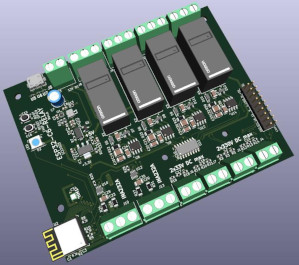

# ESP32C6-RelayBoard
Board with relays and sensors with ESP32C6 SOC. [ESP32C6RelayBoard schematic in PDF format](ESP32C6RelayBoard.pdf)

 
 

**Board contains the following interfaces:**
- 4 x Latching relay 250 VAC, 24 VDC / 16A
- 2 x INA232 Current & Power Monitors & Regulators 48-V, 16-bit high-precision IC output digital power monitor
- 2 x 330V -> 3.3V Voltage divider connected to A/D converter ADC1 of CPU
- 2 x 33V -> 3.3V Voltage divider connected to A/D converter ADC1 of CPU
- 1 x Humidity sensor BME280 measuring relative humidity, barometric pressure and ambient temperature
- Extension connector with the following signals exposed:  
  +5V  
  +3.3V  
  GND  
  UOTXD  
  UORXD  
  GPIO4  
  GPIO5  
  GPIO8  
  GPIO9  
  GPIO14  
  GPIO15  
  GPIO18  
  GPIO19  
  CHIP_PU/RESET  
